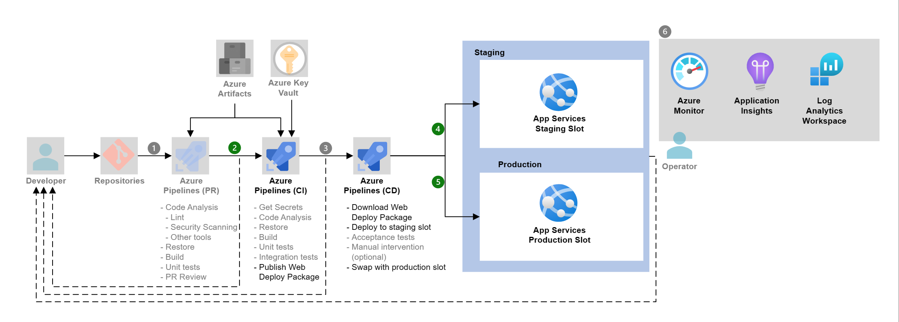

# Azure DevOps Hands-on Lab

## Hands-on Lab 개요

* 본 실습은 한국마이크로소프트 파트너사팀에서 Project Journey 프로그램에 참여한 파트너사의 교육을 위하여 제작되었습니다.
* Project Journey는 2021년부터 운영된 마이크로소프트 파트너팀의 기술 프로그램으로 Cloud Adoption Framework의 이해와 Landing Zone 디자인 영역의 기술력 확보 및
Azure Migration & Mordernization 프로젝트 수행을 위한 기술력 향상을 목적으로 디자인 되었습니다.

## Azure DevOps 개요

* Azure DevOps는 개발자, 프로젝트 관리자 및 기여자를 모아 소프트웨어를 개발하는 공동 작업 문화와 프로세스 집합을 지원합니다. 

  * Azure Boards: Kanban 및 스크럼 메서드를 사용하여 계획 및 추적 작업, 코드 결함 및 문제를 지원하는 Agile 도구 모음을 제공합니다.
  * Azure Repos: 코드의 소스 제어를 위해 Git 리포지토리 또는 TFVC(Team Foundation 버전 제어)를 제공합니다.
  * Azure Pipelines: 애플리케이션의 지속적인 통합 및 제공을 지원하는 빌드 및 릴리스 서비스를 제공합니다.
  * Azure Test Plans: 수동/예비 테스트 및 지속적인 테스트를 포함하여 앱을 테스트하는 몇 가지 도구를 제공합니다.
  * Azure Artifacts: 팀에서 공개 및 프라이빗 원본에서 Maven, npm, NuGet 등의 패키지를 공유하고 패키지 공유를 파이프라인에 통합할 수 있습니다.

## Hands-on Lab 소개

* 본 실습에서는 Azure DevOps 프로젝트를 생성하여 Azure DevOps의 서비스 중에 Azure Repos와 Azure Pipelines을 이용하여 Azure에서 제공하는 Git Repository와 연동하여 Source Control을 관리하고, Build 및 배포 Pipe라인을 구성하고 수행합니다. 

## 사용 리소스 및 환경
  * Azure DevOps
  * Azure Container Registry
  * Azure App Service
  * Azure Virtual Machine

## High Level Architecture
> 

## 사전 요구 사항 (필요 도구)

* Azure 구독. Azure 구독이 없는 경우 [체험 계정](https://azure.microsoft.com/ko-kr/free/?WT.mc_id=A261C142F)을 만듭니다.
* [Git Client 설치](https://git-scm.com/downloads)
* [Azure Cli](https://docs.microsoft.com/ko-kr/cli/azure/install-azure-cli)
* [Visual Studio Code](https://code.visualstudio.com/download)
* [Visual Studio Code WSL](https://learn.microsoft.com/en-us/windows/wsl/)

## 실습 순서

* [Step 1. Source Control with Git](https://github.com/jeongaelee/AzureDevOps/blob/master/step01.md)
* [Step 2. YAML을 사용하여 Build Pipeline 구성](https://github.com/jeongaelee/AzureDevOps/blob/master/step02.md)
* [Step 3. YAML을 사용하여 Build Pipeline 구성 - Azure App Service 웹앱 배포](https://github.com/jeongaelee/AzureDevOps/blob/master/step03.md)
* [Step 4. Self-hosted Azure DevOps Agent에서 Selenium으로 Functional 테스트](https://github.com/jeongaelee/AzureDevOps/blob/master/step04.md)