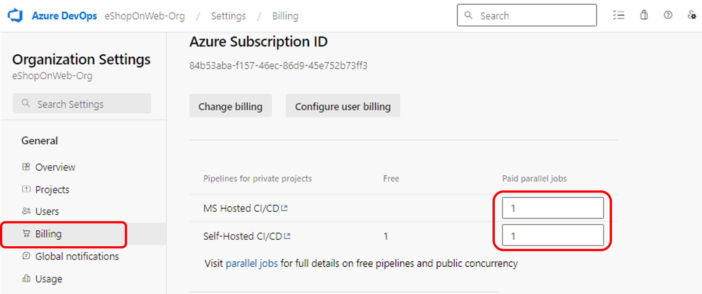
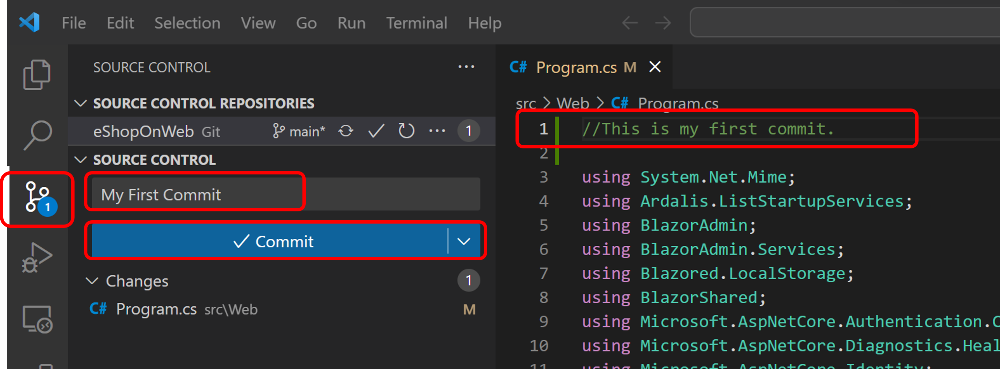
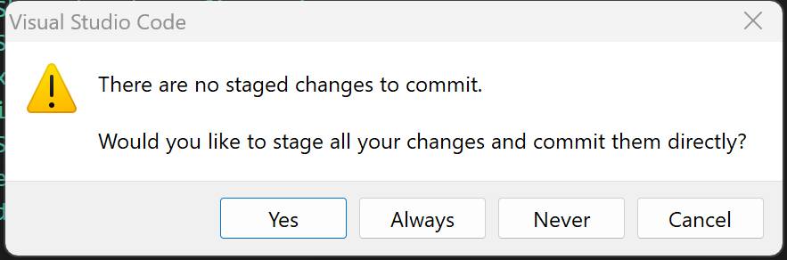

# Azure DevOps Hands-on Lab

## Step 1. Source Control with Git

* Azure DevOps는 Git과 Team Foundation Version Control(TFVC)의 두가지 타입의 버전 컨트롤을 지원합니다.

* TFVC: Team Foundation Version Control (TFVC)는 중앙 집중식 버전 제어 시스템입니다. 일반적으로 팀 멤버는 자신의 고유 개발 컴퓨터에 각 파일 버전 하나만 보유합니다. 기록 데이터는 서버에만 보관됩니다. 분기는 경로에 기반을 두며 서버에서 만들어집니다.

* Git: Git은 분산 버전 제어 시스템입니다. 개발자마다 자신의 개발 시스템에 원본 리포지토리의 복사본이 있습니다.  개발자는 네트워크 연결 없이 개발자의 개발 시스템에서 각 변경 사항 집합을 커밋, 기록, 비교하는 등의 버전 제어 작업을 수행할 수 있습니다.

* Azure DevOps에서 프로젝트를 생성하면 Git이 기본 버전 컨트롤 시스템으로 설정됩니다. TFVC의 중앙 집중식 버전 제어 시스템 기능이 특별히 필요한 경우가 아니라면, Git을 사용하는 것이 좋습니다.

* 이번 단계에서는 Azure DevOps의 Git 저장소를 설정하는 방법을 학습합니다. 또한, Git branch 및 merge 기능에 대해서 알아봅니다. 본 실습에서는 Visual Studio Code를 사용하지만, 어떤 Git-호환 클라이언트를 사용하여도 같은 프로세스를 수행할 수 있습니다.

## 실습 단계

### Azure DevOps 프로젝트 생성

* 이번 단계에서는 Azure DevOps Organization과 프로젝트를 생성합니다.

1. [Azure DevOps 포털](https://dev.azure.com/)에 접속합니다. 기존에 생성한 Organization이 없다면 "New organization"을 클릭하여 새로운 Azure DevOps Organization을 생성합니다. Organization 이름은 "eShopOnWeb-Org"로 생성합니다.

    > 

2. Azure DevOps의 "Organization settings"의 "Billing"메뉴에서 MS Hosted CI/CD와 Self-Hosted CI/CD의 값을 1로 셋팅하고 "Save"합니다.

    > 

3. 실습을 진행할 새로운 Azure DevOps 프로젝트를 생성합니다. Organization에 프로젝트가 아무것도 존재하지 않는다면, 아래와 같이 "Create a project to get started" 화면이 나타납니다. 이미 다른 프로젝트가 존재한다면, 오른쪽 상단의 "+ Net project" 버튼을 클릭하여 새로운 프로젝트를 생성합니다. 프로젝트 생성 화면에서 아래와 같이 프로젝트 정보를 입력하고, "+ Create project" 버튼을 클릭합니다.

  * Project name: eShopOnWeb
  * Visibility: Private
  * Advanced - Version control: Git, Work item process: Scrum

    > 

* Note: Azure Board는 work item을 관리하기 위한 다양한 프로세스를 지원합니다. [4가지 프로세스 옵션에 대한 자세한 설명은 링크의 문서](https://learn.microsoft.com/ko-kr/azure/devops/boards/work-items/guidance/choose-process?view=azure-devops&tabs=agile-process#default-processes)를 참고하시기 바랍니다. 본 실습에서는 Scrum을 선택 합니다.

### Repository Import

* 이번 단계에서는 Azure DevOps의 Git Repository에 소스 코드를 Import 합니다.

1. 왼쪽 메뉴에서 "Repos > Files"를 선택하고 아래쪽의 "Import" 버튼을 클릭합니다.

    > 

2. "Import a Git repository" 화면에서 아래와 같이 Repository type을 "Git"으로 선택하고 "Clone URL" 항목에 "https://github.com/MicrosoftLearning/eShopOnWeb.git" URL을 붙여넣기 한 후 "Import" 버튼을 클릭합니다.

    > 

3. Import된 Repository는 아래와 같은 구성으로 생성됩니다.

* .ado 폴더: Azure DevOps YAML 파이프라인 파일들
* .devcontainer 폴더: 컨테이너를 사용하여 개발하기 위한 컨테이너 셋업 (VS Code 로컬 혹은 GitHub Codespaces에서)
* .azure 폴더: 특정 랩 시나리오에서 사용되는 Bicep&ARM infrastructure as code 템플릿
* .github 폴더: GitHub workflow definitions의 YAML 파일
* src 폴더: 본 실습 시나리오에서 사용되는 .NET 6 웹사이트 소스 코드

### Git과 Visual Stuido Code 연동

* 이번 단계에서는 Visual Studio Code를 사용하여 Azure DevOps의 Git Repository를 로컬에 복사합니다.

1. Visual Studio Code를 켜고, "Teminal > New Termanal"을 실행합니다.

2. Git Credential Helper를 실행하여, id와 password를 한 번만 입력하고 다음부터는 로그인 정보를 다시 요구하지 않도록 합니다.

    ```
    git config --global credential.helper wincred
    ```

3. Repos>Files 메뉴에서 생성된 Clone을 실행하기 위한 Git Repository의 주소를 복사합니다. (참고: 로컬에 Repository를 복사하는 것을 Clone이라고 합니다.)

    > 

4. Visual Studio Code에서 Comman Palette (Ctrl+Shift+P)를 실행하고, "Git: Clone()"을 검색하여 실행합니다.

    > 

5. Git Repository의 주소를 붙여넣기 하고, 로컬에 저장할 폴더를 선택합니다.

6. Azure DevOps에 로그인을 하기 위하여 Git Credential Manager가 실행됩니다. Azure DevOps에 로그인을 하면, Visual Studio Code에서 Clone한 폴더를 새 윈도우로 실행하고, Azure DevOps의 Git Repository에 접근할 수 있습니다.

    > 

### 소스 업데이트와 Commit

1. Visual Studio Code에서 /eShopOnWeb/src/Web/Program.cs 파일을 찾아서 열고, 파일에 아래와 같은 커멘트를 넣어 파일을 수정한 후 저장합니다. (파일을 업데이트하기 위한 작업이므로 커멘트 내용은 상관이 없습니다.)

    ```
    // This is my fisrt commit
    ```

2. Visual Studio Code 윈도우에서 "Source Control" 메뉴를 선택하고, 텍스트 박스에 커밋 메시지를 입력한 후, "Commit" 버튼을 클릭하여 로컬에 커밋합니다.

    > 

3. 팝업 윈도우에서 "Always"를 선택하여 커밋을 완료합니다.

    > 

4. Visual Studio Code 윈도우에서 "Source Control" 메뉴를 선택하고, "Sync Changes" 버튼을 클릭하여 Azure DevOps의 Git Repository에 커밋을 Push합니다.

    > 

5. origin/main에 push & pull 하겠다는 팝업 메세지에서 "ok"를 선택합니다.

    > 

6. Azure DevOps Portal의 "Repos>Commits" 메뉴 에서 Commit된 내용을 확인합니다.

    > 

## Git Branch 생성 (dev branch)

* 이번 단계에서는 Visual Studio Code와 Auzre DevOps Portal에서 Git Branch를 생성하고 관리하는 방법을 실습합니다.

1. Visual Studio Code에서 Terminal을 실행하고 Git Bash 터미널을 추가합니다. 아래와 같이 Git Branch를 생성합니다.

    ```
    git branch dev
    git checkout dev
    ```

2. dev 브랜치가 생성되었는지 확인합니다.

    ```
    git branch
    ```
   
    *Note: branch 생성은 VS Code의 Comman Palette (Ctrl+Shift+P)에서 "+ Create new branch"를 선택하여 생성할 수도 있습니다.

3. Branch가 생성되고 checkout을 하면 아래와 같이 Visual Studio Code의 좌측 하단에서 branch가 main에서 dev로 변경된 것을 보실 수 있습니다.

    > 

4. Visual Studio Code에서 /eShopOnWeb/src/Web/Program.cs 파일을 찾아서 열고, 커멘트를 수정한 후 저장합니다. (마찬가지로 파일을 업데이트하기 위한 작업이므로 커멘트 내용은 상관이 없습니다.) 위의 이미지에서 dev branch 옆의 "Push change" 아이콘을 클릭하여 변경 내용을 dev branch에 push합니다.

## Branch Policy 설정 및 테스트

* 이번 단계에서는 Azure DevOps Portal에서 Branch Policy를 설정하고, Policy가 잘 동작하는지 확인합니다.

1. Azure DevOps Portal의 "Repos>Branches" 메뉴에서 main branch를 선택하고, "Branch policies"를 선택합니다.

    > `

2. main의 Policies 탭의 "Branch Policies"에서 "Require a minimum number of reviewers"를 On하고, "1"로 변경합니다. "Allow requestors to approve their own changes"을 체크합니다. (실습에서 본인의 Approval을 허용하기 위함이지만, 실제 프로젝트에서는 peer review 혹은 개발 lead가 review를 하는 것이 좀 더 일반적입니다.)
   "Check for linked work items"를 "Required"로 On 합니다.

    > 

3. "Repos>Files"에서 "main" branch가 선택되었는지 확인하고 /eShopOnWeb/src/Web/Program.cs (혹은 아무 파일이나) 파일을 선택하여 "Edit" 버튼을 클릭하여 수정합니다.

    > 

4. Commit 화면에서 "Commit"을 하려고 하면 아래와 같이 Policy가 적용되어 main branch에는 직접 push할 수 없음을 확인할 수 있습니다.

    > 

## Pull Request

* 이번 단계에서는 Azure DevOps Portal에서 Pull Request를 생성하고, dev branch를 이용하여 변경사항을 Merge하여 Main branch를 보호하는 방법을 학습합니다. Azure DevOps work item을 Pull Request에서 연결하여 코드 변화를 추적하는 방법도 학습합니다.

1. Azure DevOps 포털의 "Boards>Work items" 메뉴를 선택합니다. "+ New Work Item"에서 "Product Backlog Item"을 선택하여 새로운 Work Item을 생성합니다. "Enter title"에 이름을 넣고 "Save"합니다.

    > 

2. "Repos>Files"에서 "dev" branch를 선택하고, /eShopOnWeb/src/Web/Program.cs 파일을 찾아서 열고, 커멘트를 수정한 후 "Commit"을 클릭합니다. (마찬가지로 파일을 업데이트하기 위한 작업이므로 커멘트 내용은 상관이 없습니다.) dev branch로의 Commit은 에러없이 정상 작동합니다. Commit되었다는 메세지가 나오면 "Create a pull request"를 클릭합니다.

    > 

3. New pull request 화면에서, Title을 입력하고, Reviewers에 Reivewer로 본인을 추가하고, Work items에 위에서 생성한 Work Item을 추가합니다. "Create"를 클릭합니다.

    > 

4. Complete pull request 화면에서 "Complete merge"를 클릭합니다.

    > 

5. Pull Request가 Merge되었음을 확인합니다. dev branch는 Merge 후 삭제 되었으므로, Repos>Files의 Branch 선택에서 사라졌음을 확인합니다.

## 실습 순서

* [Step 1. Source Control with Git](https://github.com/jeongaelee/AzureDevOps/blob/master/step01.md)
* [Step 2. YAML을 사용하여 Build Pipeline 구성](https://github.com/jeongaelee/AzureDevOps/blob/master/step02.md)
* [Step 3. YAML을 사용하여 Build Pipeline 구성 - Azure App Service 웹앱 배포](https://github.com/jeongaelee/AzureDevOps/blob/master/step03.md)
* [Step 4. Self-hosted Azure DevOps Agent에서 Selenium으로 Functional 테스트](https://github.com/jeongaelee/AzureDevOps/blob/master/step04.md)
    