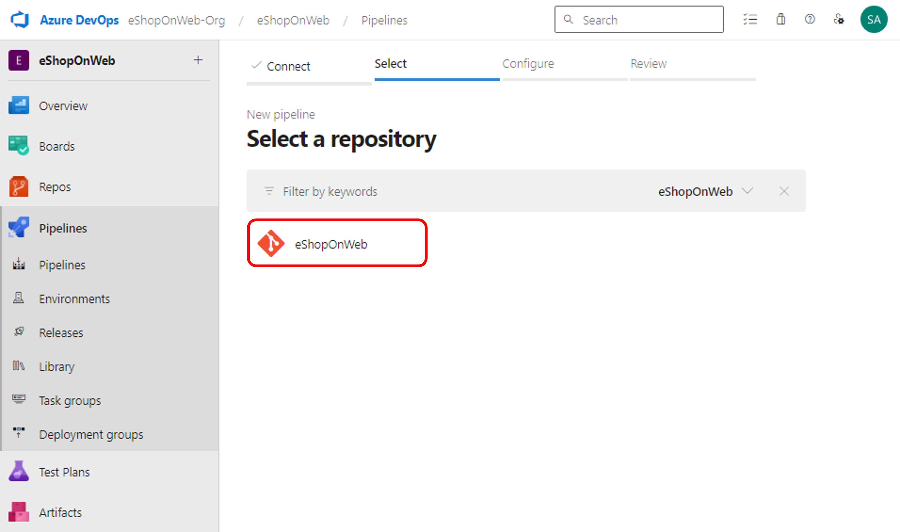

# Azure DevOps Hands-on Lab

## Step 2. YAML을 사용하여 Build Pipeline 구성 - Azure App Service 웹앱 배포

* 이번 단계에서는 Azure DevOps의 Build Pipeline을 구성하는 방법을 실습합니다.

### 서비스 연결 관리

* Azure Pipeline에서 외부와 원격 서비스에 연결하여 job의 task를 실행하기 위해서는 connection을 생성해야 합니다. 이번 단계에서는 Azure CLI로 서비스 주체 (Service Principal)을 생성하여 Azure DevOps가 Azure의 구독에 리소스를 배포하고, Docker 이미지를 Azure Container Registry에 Push하고, Azure App Service가 Azure Contrainer Registry에서 Docker 이미지를 Pull할 수 있도록 역할 할당 (Role assignment)을 추가합니다.

* 파이프라인 정의 내부에서 Azure 구독에 연결하거나 프로젝트 설정 페이지(자동 옵션)에서 새 서비스 연결을 만들 때 Azure Pipeline에서 서비스 주체가 자동으로 생성됩니다. 포털에서 수동으로 서비스 주체를 생성하거나 Azure CLI를 사용하여 프로젝트 간에 서비스 주체를 재사용할 수도 있습니다.

1. 서비스 주체 (Service Principal)을 정의하기 위하여, Azure Portal의 Cloud Shell을 실행합니다. Cloud Shell은 Azure Portal의 우측 상단에 위치한 아이콘을 클릭하면 실행할 수 있습니다.

    > 

2. Cloud Shell이 실행되면, 아래와 같이 PowerShell을 선택합니다. 

    > 

3. Cloud Shell을 처음 실행하면, Azure Cloud Shell 환경을 구성하기 위하여 스토리지 생성이 필요합니다. 스토리지 생성을 위한 메시지가 나타나면, "스토리지 만들기"를 선택합니다.

    > 

4. Cloudshell에서 아래의 Azure CLI를 실행하여 서비스 주체를 만듭니다. "{subscription-id}"을 작업중인 Azure 구독과 앱 이름에 맞게 변경하고, "{myApp}"에는 Azure App Service에 배포한 unique한 웹 앱의 이름을 입력합니다. (예: eshoponwebabcd)

    > az ad sp create-for-rbac --name {myApp} --role contributor --scopes /subscriptions/{subscription-id}

5. #1을 실행하면 Azure CLI가 아래의 형태로 JSON 형식으로 서비스 주체를 반환합니다. 이를 복사하여 GitHub Secret에 등록합니다. "AZURE_CREDENTIALS"라는 이름으로 등록합니다.
    > {
    >   "clientId": "<GUID>",
    >   "clientSecret": "<GUID>",
    >   "subscriptionId": "<GUID>",
    >   "tenantId": "<GUID>",
    >   (...)
    > }

6. Azure DevOps 포털에 들어가서 eShopOnWeb 프로젝트를 선택하고, Project Settings>Service Connections 메뉴로 이동한 후 "Create service connection" 버튼을 클릭합니다.

    > 

7. New service connection 창에서 connection type으로 "Azure Resource Manager"를 선택하고 "Next" 버튼을 클릭합니다.

    > 

8. Authentication method에서 "Service principal (manual)"을 선택하고 "Next" 버튼을 클릭합니다.

    > 

9. 아래와 같이 구독 및 서비스 주체 정보를 입력하고 "Verify" 버튼을 클릭하여 검토합니다.

    * Environment: Azure Cloud
    * Scope Level: Subscription
    * Subscription Id: {subscription-id}, 구독 ID
    * Subscription Name: {subscription-name}, 구독명
    * Service Principal Id: {clientId 혹은 appId}, 서비스 주체의 클라이언트 ID
    * Service Principal Key: {clientSecret 혹은 password}, 서비스 주체의 클라이언트 비밀
    * Tenant Id: {tenantId}, 테넌트 ID

    > 

10. Detail 영역의 Service connection name을 "azure-connection"으로 입력하고 "Verify and save" 버튼을 클릭하여 검토 및 저장합니다.

    > 

11. Azure DevOps 포털의 Project Settings>Service Connections 메뉴에서 "azure-connection"이 생성된 것을 확인합니다.

    > 

### CI 파이프라인 구성 및 실행

* 이번 단계에서는 Azure DevOps의 Build Pipeline을 구성하는 방법을 배웁니다.

1. Azure DevOps 포털의 Pipelines>Pipelines 메뉴에서 "Create Pipeline" 버튼을 클릭합니다.

    > 

2. Where is your code? 화면에서 "Azure Repos Git (YAML)"을 선택합니다.

    > 

3. Select a repository 화면에서 "eShopOnWeb"을 선택합니다.

    > 

4. configure your pipeline 화면에서 "Existing Azure Pipelines YAML File"을 선택합니다.

    > 

5. /.ado/eshoponweb-ci-docker.yml 파일을 선택하고 "Continue" 버튼을 클릭합니다.

    > 

6. Review your pipeline 화면에서 아래의 variables 값을 본인의 구독 정보에 맞게 변경한 후 "Save and run" 버튼을 클릭합니다.

    ```
    variables:
      azureServiceConnection: 'azure-connection'
      subscriptionId: 'YOUR-SUBSCRIPTION-ID'
      resourceGroup: 'eshoponweb-container-rg'
      location: 'koreacentral'
    ```

7. Save and run 화면에서 Commite message를 입력하고 "Save and run" 버튼을 클릭합니다.

    > 

7. CI 파이프라인이 저장되고 실행이 되려고 하면서 아래와 같이 빌드를 진행하기 위하여 리소스에 접근하기 위한 Permission이 필요하다고 나옵니다. 아래와 같은 과정으로 Access 권한을 부여합니다.

* Note: 이 과정을 파이프라인마다 수행하지 않으려면 Azure Service Connection을 생성하는 과정의 6번 단계에서 "Grant access permission to all pipelines" 옵션을 선택하면 됩니다.

    > 

8. Build 파이프라인이 실행되면 단계별로 수행되는 과정을 아래의 로그와 같이 보실 수 있습니다.

    > 

9. Build 파이프라인이 성공하면 아래와 같이 Build의 Status가 Success 된 것을 보실 수 있습니다.

    > 

10. [Azure Portal](https://portal.azure.com)에서 파이프라인의 YAML 파일에서 지정한 새로 생성된 리소스 그룹을 확인합니다. 리소스 그룹에 Azure Container Registry가 생성된 것을 확인하실 수 있습니다. 리포지토리 메뉴에 eshoponweb/web이 생성되고, latest를 포함한 2개의 tag를 확인하실 수 있습니다.

    > 

## 실습 순서

* [Step 1. Source Control with Git](https://github.com/jeongaelee/AzureDevOps/blob/main/step01.md)
* [Step 2. YAML을 사용하여 Build Pipeline 구성](https://github.com/jeongaelee/AzureDevOps/blob/main/step02.md)
* [Step 3. YAML을 사용하여 Build Pipeline 구성 - Azure App Service 웹앱 배포](https://github.com/jeongaelee/AzureDevOps/blob/main/step03.md)
* [Step 4. Self-hosted Azure DevOps Agent에서 Selenium으로 Functional 테스트](https://github.com/jeongaelee/AzureDevOps/blob/main/step04.md)
