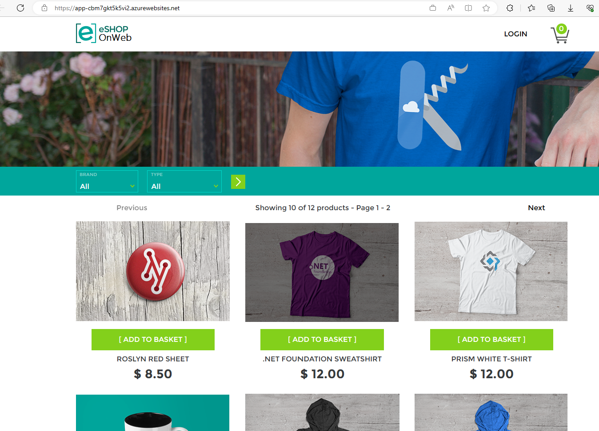

# Azure DevOps Hands-on Lab

## Step 3. YAML을 사용하여 Deploy Pipeline 구성

* 이번 단계에서는 Azure DevOps의 Deploy Pipeline을 구성하는 방법을 배웁니다.

### 새로운 역할할당 추가

* 이번 단계에서는 Azure App Service에서 Docker 이미지를 Azure Container Registry에서 pull 하기 위한 새로운 역할할당을 추가합니다.

1. Azure Portal의 Cloud Shell을 실행합니다. 이전 단계에서 실행했듯이, Cloud Shell은 Azure Portal의 우측 상단에 위치한 아이콘을 클릭하면 실행할 수 있습니다.

> 

2. Cloud Shell이 실행되면, 아래와 같이 Bash를 선택합니다. 

3. Bash가 실행되면, 아래의 명령어를 실행하여 Service Principal ID와 User Access Administrator 역할 ID를 확인합니다. {myApp}에는 이전 Step 2 단계의 서비스 연결 관리 > 4번째의 서비스 주체를 만들때 사용하였던 {myApp} 값을 입력합니다.

    ```
    spId=$(az ad sp list --display-name {myApp} --query "[].id" --output tsv)
    echo $spId
    roleName=$(az role definition list --name "User Access Administrator" --query [0].name --output tsv)
    echo $roleName

    명령어를 실행하면 아래와 같은 형태의 UUID 두개 (Principal ID, roleName)가 출력됩니다.

    ```
    7927e8db-144f-abcd-efgh-11c186d87cd3
    18d7d88d-d35e-abcd-efgh-7773c20a72d9
    ```

4. 위의 단계에서 출력된 $spId와 $roleName 값을 사용하여 아래의 명령어를 실행합니다. resource-group은 앞에서 Azure Container Registry를 생성하였든 리소스 그룹 이름을 입력합니다.

    ```
    az role assignment create --assignee $spId --role $roleName --resource-group "eshoponweb-container-rg"
    ```

5. 아래와 같은 JSON 형식의 output이 출력되면 성공적으로 역할할당이 추가된 것입니다.

    ```
    {
    "condition": null,
    "conditionVersion": null,
    "createdBy": null,
    "createdOn": "2023-06-16T13:57:08.566343+00:00",
    "delegatedManagedIdentityResourceId": null,
    "description": null,
    "id": "/subscriptions/31a6ad78-abcd-efgh-ijkl-76a6e10ed89c/resourceGroups/eshoponweb-container-rg/providers/Microsoft.Authorization/roleAssignments/4712ac8b-abcd-efgh-ijkl-42b998a6c045",
    "name": "4712ac8b-abcd-efgh-ijkl-42b998a6c045",
    "principalId": "7927e8db-abcd-efgh-ijkl-11c186d87cd3",
    "principalType": "ServicePrincipal",
    "resourceGroup": "eshoponweb-container-rg",
    "roleDefinitionId": "/subscriptions/31a6ad78-abcd-efgh-ijkl-76a6e10ed89c/providers/Microsoft.Authorization/roleDefinitions/18d7d88d-abcd-efgh-ijkl-7773c20a72d9",
    "scope": "/subscriptions/31a6ad78-abcd-efgh-ijkl-76a6e10ed89c/resourceGroups/eshoponweb-container-rg",
    "type": "Microsoft.Authorization/roleAssignments",
    "updatedBy": "80678833-abcd-efgh-ijkl-846d5603ea1e",
    "updatedOn": "2023-06-16T13:57:09.879857+00:00"
    }
    ```

### CD 파이프라인 구성 및 실행

1. Azure DevOps 포털의 Pipelines>Pipelines 메뉴에서 "New pipeline" 버튼을 클릭합니다.

    > 

2. Where is your code? 화면에서 "Azure Repos Git (YAML)"을 선택합니다.

    > 

3. Select a repository 화면에서 "eShopOnWeb"을 선택합니다.

    > 

4. configure your pipeline 화면에서 "Existing Azure Pipelines YAML File"을 선택합니다.

    > 

5. /.ado/eshoponweb-cd-docker.yml 파일을 선택하고 "Continue" 버튼을 클릭합니다.

    > 

6. Review your pipeline 화면에서 아래의 variables 값을 본인의 구독 정보에 맞게 변경한 후 "run" 버튼을 클릭합니다.

    ```
    variables:
      azureServiceConnection: 'azure-connection'
      subscriptionId: 'YOUR-SUBSCRIPTION-ID'
      resourceGroup: 'eshoponweb-container-rg'
      location: 'koreacentral'
    ```

* YAML 파일은 아래의 tasks로 구성되어 있습니다.
    * Resources: Task에서 사용될 Repository에 있는 파일들을 다운로드 합니다.
    * AzureResourceManagerTemplateDeployment: Bicep 템플릿 (.azure/bicep/webapp-docker.bicep)을 이용하여 Azure App Service를 배포합니다.
    * AzureResourceManagerTemplateDeployment: Bicep 템플릿 (.azure/bicep/webapp-to-acr-roleassignment.bicep) 을 이용하여 역할 할당 (Role assignment)를 추가합니다.

7. Step 2와 Step 3에서 생성된 CI와 CD 파이프라인의 이름을 좀 더 의미있게 변경합니다. 아래의 그림과 같이 CI 파이프라인의 이름을 "eShopOnWeb-CI"로, CD 파이프라인의 이름을 "eShopOnWeb-CD"로 변경합니다. 아래의 화면에서 Rename/move 메뉴를 클릭하여 이름을 변경할 수 있습니다. eShopOnWeb -> eShopOnWeb-CI로 변경하고, eShopOnWeb (1) -> eShopOnWeb-CD로 변경합니다.

    > 

### 웹앱 배포 확인

1. Azure Portal로 가서, 리소스 그룹에 생성된 App Service (Web App)로 이동합니다. 기본 도메인의 URL을 복사합니다.

    > 

2. 웹브라우저에서 URL을 붙여넣기 하면 아래와 같은 eShopOnWeb 웹앱이 실행되는 것을 확인할 수 있습니다.

    > 

## 실습 순서

* [Step 1. Source Control with Git](https://github.com/jeongaelee/AzureDevOps/blob/main/step01.md)
* [Step 2. YAML을 사용하여 Build Pipeline 구성](https://github.com/jeongaelee/AzureDevOps/blob/main/step02.md)
* [Step 3. YAML을 사용하여 Build Pipeline 구성 - Azure App Service 웹앱 배포](https://github.com/jeongaelee/AzureDevOps/blob/main/step03.md)
* [Step 4. Self-hosted Azure DevOps Agent에서 Selenium으로 Functional 테스트](https://github.com/jeongaelee/AzureDevOps/blob/main/step04.md)
