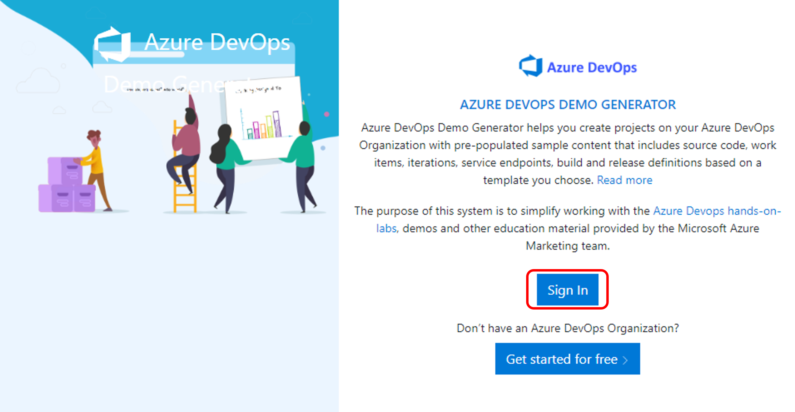
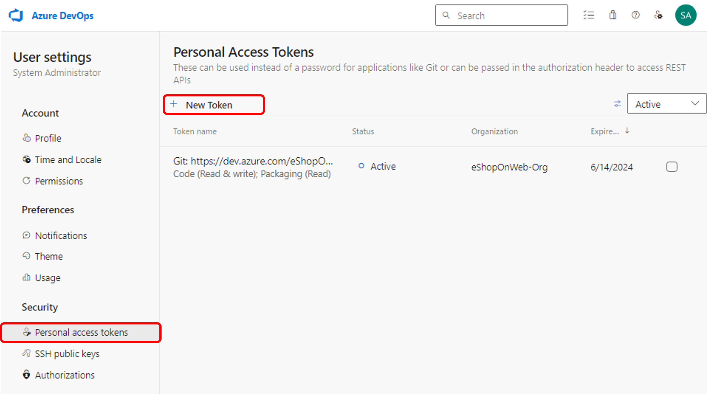

# Azure DevOps Hands-on Lab

## Step 4. Self-hosted Azure DevOps Agent에서 Selenium으로 Functional 테스트

* 이번 단계에서는 Self-hosted Azure DevOps 에이전트를 설정하고, Selenium을 사용하여 Functional 테스트를 Azure DevOps 파이프라인에서 수행하는 방법을 학습합니다.

* Selenium은 웹 애플리케이션을 위한 간편한 오픈 소스 소프트웨어 테스트 프레임워크입니다. 거의 모든 운영 체제에서 작동할 수 있으며, 모든 최신 브라우저와 .NET(C#) 및 Java를 포함한 여러 언어를 지원합니다.

### Azure DevOps Demo Generator를 이용하여 새로운 프로젝트 생성

1. [Azure DevOps Demo Generator](https://azuredevopsdemogenerator.azurewebsites.net)에 접속하여 새로운 프로젝트를 생성합니다. Azure DevOps Demo Generator 사이트는 Azure DevOps 프로젝트를 생성하고, 샘플 애플리케이션을 프로젝트에 배포하는 등의 작업을 자동으로 수행해주는 사이트입니다. (참고: https://learn.microsoft.com/en-us/azure/devops/demo-gen/?view=azure-devops)

2. 아래의 화면이 나오면 "Sign In"을 클릭하여 Azure DevOps에 연결되어있는 구독에 로그인합니다.

    > 

3. "Choose template"을 클릭하면 아래와 같은 화면이 나타납니다. "DevOps Labs" 탭에 있는 "Selenium"을 선택하고 "Select Template"을 클릭합니다.

    > 

4. 프로젝트 명을 "Functional Test Project"로 입력하고, "Create Project"를 클릭합니다. Organization은 이전 단계에서 사용하였던 eShopOnWeb-Org를 선택합니다. 프로젝트를 생성하는데 1~2분 정도 소요됩니다.

    > 

5. 프로젝트 생성이 완료되면 "Congratulations! Your project is successfully provisioned."라는 문구가 나옵니다. 아래에 있는 "Navigate to project"를 선택하여 프로젝트로 이동합니다.

    > 

### Self-hosted Agent 설치를 위한 Azure VM 생성

1. [이 링크](https://portal.azure.com/#create/Microsoft.Template/uri/https%3A%2F%2Fraw.githubusercontent.com%2FMicrosoft%2Falmvm%2Fmaster%2Flabs%2Fvstsextend%2Fselenium%2Farmtemplate%2Fazuredeploy.json)를 클릭하여 Azure VM을 생성을 위한 사용자 지정 배포 화면으로 이동합니다.

2. 아래와 같이 사용자 지정 배포 화면이 나오면 "템플릿 편집"을 선택합니다.

    > 

3. 템플렛 편집 화면에서 "https://raw.githubusercontent.com/microsoft/azuredevopslabs/master/labs/vstsextend/selenium/armtemplate/chrome_firefox_VSTSagent_IIS.ps1" 라인을 찾아서 "https://raw.githubusercontent.com/MicrosoftLearning/AZ400-DesigningandImplementingMicrosoftDevOpsSolutions/master/Allfiles/Labs/11b/chrome_firefox_VSTSagent_IIS.ps1"로 변경하고 "저장" 합니다.

    > 

4. 리소스 그룹을 "devops-test-rg"등의 이름으로 새로 만들기 하고, Virtual Machine Name에 "agentvm"을 입력한 후 "검토 + 만들기"를 클릭합니다. (주의: VM이름은 10자 이내로 입력해야 합니다. 그렇지 않으면 관련 리소스가 생성되는 과정에서 이름 길이 제한에 걸려서 배포가 실패합니다.)

*Note: VM 생성에는 20~30여분 정도가 소요됩니다. 다음 단계는 배포가 완료된 후에 진행 할 수 있습니다.

### VM에 Self-hosted Agent 설치

1. 생성된 "agentvm" VM으로 이동하여, "연결" 메뉴를 클릭합니다. VM에 Remote Desktop 연결을 위하여 "RDP 파일 다운로드"를 합니다.

    > 

2. 다운로드 받은 RDP 파일을 실행하여 VM에 연결합니다. 

    > ID: vmadmin
    > Password: P2ssw0rd@123

3. VM에 연결되면, Chrome 브라우저를 열어서 https://dev.azure.com으로 접속하고 로그인합니다. 로그인 후에 "Organization settings"를 클릭합니다.

4. 왼쪽 메뉴에서 "Pipelines > Agent pools"를 선택하고, "Default"를 선택합니다.
    
    > 

5. "Agents" 탭에서 "New agent"를 클릭하면 "Get the agent" 화면이 나타납니다. "Windows"의 "x64"를 선택하고, "Download"를 클릭합니다.

    > 

6. C:\AzAgent 디렉토리를 생성하고, 다운로드 받은 zip 파일을 이 디렉토리에 풉니다. 

7. VM 윈도우에서 "Start" 메뉴를 우클릭하고, "Command Prompt (Admin)"을 실행합니다. "Administrator: Command Prompt" 윈도우에서 아래와 같이 Agent 바이너리를 인스톨하는 명령어를 실행합니다.

    ```
    cd C:\AzAgent
    Config.cmd
    ```

8. "Administrator: Command Prompt" 윈도우에서 URL 입력을 요구하는 메시지가 나오면, 아래와 같이 입력합니다. <your organization name>에는 eShopOnWeb-Org를 입력합니다.

    ```
    https://dev.azure.com/<your organization name>
    ```

9. 계속해서 "Enter Authentication type (press enter for PAT)"이라는 메시지가 나오면, Enter 키를 누릅니다.

10. 다음으로 "Enter personal access token"이라는 메시지가 나오면, Azure DevOps 포털에서 오른쪽 상단의 "User settings" 아이콘을 클릭하고, "Personal access tokens"를 클릭합니다.

    > 

11. "Personal access tokens" 화면에서 "New Token"을 클릭합니다. 

    > 

12. "Name"에 "Self-hosted Agent Token"을 입력하고, Scope을 "Custom defined"로 선택한 후 아래쪽의 "Show all scopes"를 클릭합니다.

    > 

13. Agent Pools의 "Read & Manage"를 셋팅하고 "Create"를 클릭합니다.

    > 
 
14. 생성된 토큰을 복사합니다. (주의: 이 토큰은 한번만 보여지기 때문에 복사를 잊어버리면 다시 생성해야 합니다.)

    > 

15. VM의 Remote Desktop 연결 세션으로 돌아가서, "Enter personal access token"이라는 메시지에 위에서 복사한 토큰값을 넣고 Enter 키를 누릅니다.

16. "Administrator: Command Prompt" 윈도우에서 아래의 항목들에 대해서 모두 Enter key를 누릅니다.

    > Enter agent pool (press enter for default)
    > Enter agent name (press enter for agentvm)
    > Enter work folder (press enter for _work)
    > Enter run agent as service (Y/N) (press enter for N)
    > Enter configure autologon and run agent on startup (Y/N) (press enter for N)

    > 

17. 위의 단계가 끝나고 Agent가 등록되면, "run.cmd" 명령어를 실행하여 Agent를 실행합니다.

18. agentvm에서 웹브라우저를 실행하여 아래 URL로 접속하여 "Microsoft® SQL Server® Data-Tier Application Framework (18.2)", "EN\x64\DacFramework.msi" 파일을 Download하고 인스톨합니다. Dac 프레임워크는 이 랩에서 배포할 애플리케이션에서 사용됩니다.

* 본 단계까지 Selenium 테스트 케이스를 실행하기 위한 Self-hosted Agent를 Azure VM에 구성하였습니다.

### Release 파이프라인 구성

1. 브라우저에서 Azure DevOps 포털을 실행하고 왼쪽 위의 Azure DevOps 로고를 클릭합니다. 프로젝트 리스트에서 "Functional Test Project"를 선택합니다.

2. "Pipelines>Releases"를 선택하고 "Selenium" 파이프라인의 "Edit"를 클릭합니다.

    > 

3. "Dev" Stage의 "3 jobs, 5 tasks"링크를 선택합니다.

    > 

4. Selenium 파이프라인을 리뷰합니다. 파이프라인은 3개의 Job으로 구성되어 있습니다.

    * IIS Deployment: 이 단계에서는 애플리케이션을 VM에 배포 합니다.
        * IIS Web App Manager: 이 Task는 에이전트를 등록한 대상 시스템에서 실행됩니다. 'http://localhost:82' 아래에서 PartsUnlimited라는 이름의 웹 사이트와 애플리케이션 풀을 로컬로 생성합니다.
        * Deploy IIS Website/App: 이 Task는 Web Deploy를 이용하여 애플리케이션은 IIS Server에 배포합니다.
    
    * SQL Deployment: 이 단계에서는 dacpac 파일을 DB 서버에 배포합니다.
    
    * Selenium tests execution: 이 단계에서는 Selenium 테스트를 실행합니다.
        * Visual Studio Test Platform Installer: nuget.org 또는 지정된 피드에서 Microsoft 테스트 플랫폼을 가져와 툴 캐시에 추가합니다. vstest 요구 사항을 충족하므로 에이전트 VM에서 전체 Visual Studio를 설치하지 않고도 빌드 또는 릴리스 파이프라인의 후속 Visual Studio Test 작업을 실행할 수 있습니다.
        * Run Selenium UI tests: vstest.console.exe을 실행하여 Agent VM에서 Selenium 테스트를 실행합니다.

5. Selenium 파이프라인의 "Selenium 파이프라인"를 선택하여, Agent pool이 "Default"로 설정되어 있는지 확인합니다. 마찬가지로, SQL Deployment과 Selenium tests execution 단계의 Agent pool이 "Default"로 설정되어 있어야 합니다.

    > 

### Build와 Release 실행

1. Azure DevOps 포털에서 "Pipelines>Pipelines"를 선택하고 "Selenium" 파이프라인을 선택합니다. "Run pipeline"을 클릭하여 파이프라인을 실행합니다. 이 빌드 파이프라인이 실행되면 테스트 아티팩트를 Publish하고 해당 테스트 아티팩트를 Release에서 사용하게 됩니다. Phase 1을 클릭하여 진행사항을 모니터링 할 수 있습니다.

    > 

    Build가 성공적으로 수행되면, Release 파이프라인이 자동으로 실행됩니다.

2. "Selenium > Release-1 > Dev 에서 배포 파이프라인 진행사항을 모니터링 합니다.
    
    > 

3. Release 파이프라인이 성공적으로 완료되면, "Selenium > Release-1 > Dev"에서 "Tests" 링크를 클릭하여 테스트 결과를 확인합니다.

    > 


## 실습 순서

* [Step 1. Source Control with Git](https://github.com/jeongaelee/AzureDevOps/blob/master/step01.md)
* [Step 2. YAML을 사용하여 Build Pipeline 구성](https://github.com/jeongaelee/AzureDevOps/blob/master/step02.md)
* [Step 3. YAML을 사용하여 Build Pipeline 구성 - Azure App Service 웹앱 배포](https://github.com/jeongaelee/AzureDevOps/blob/master/step03.md)
* [Step 4. Self-hosted Azure DevOps Agent에서 Selenium으로 Functional 테스트](https://github.com/jeongaelee/AzureDevOps/blob/master/step04.md)